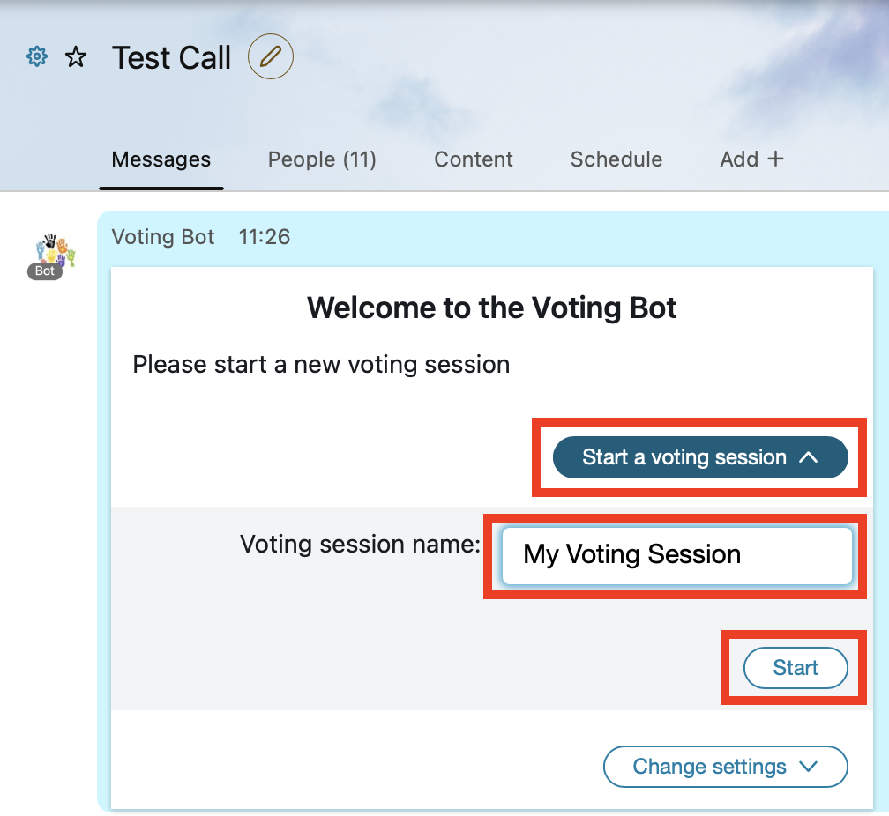
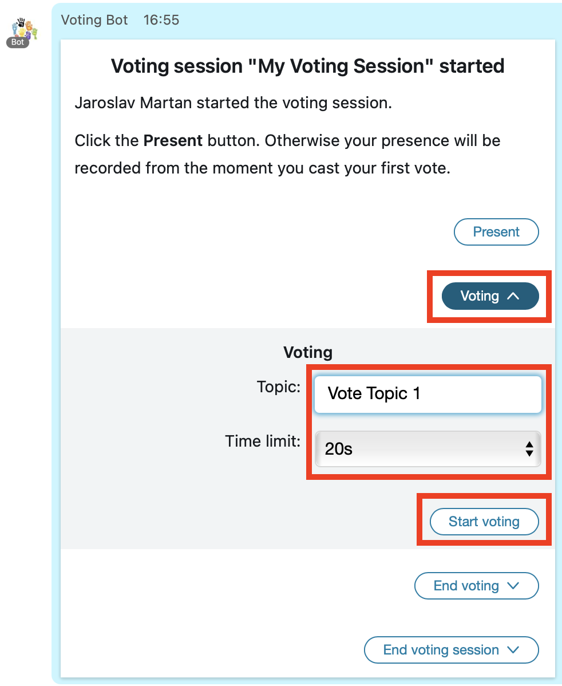
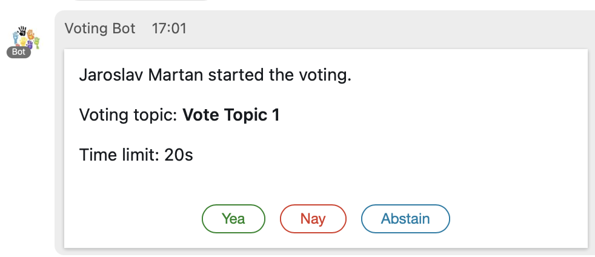
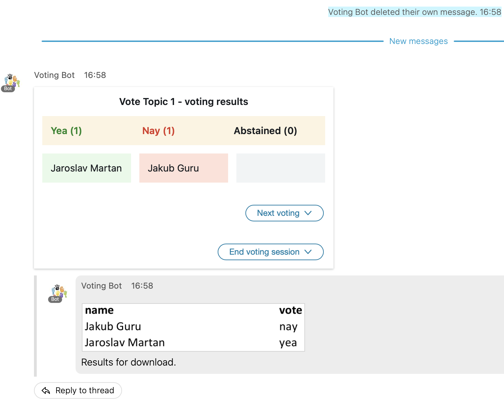
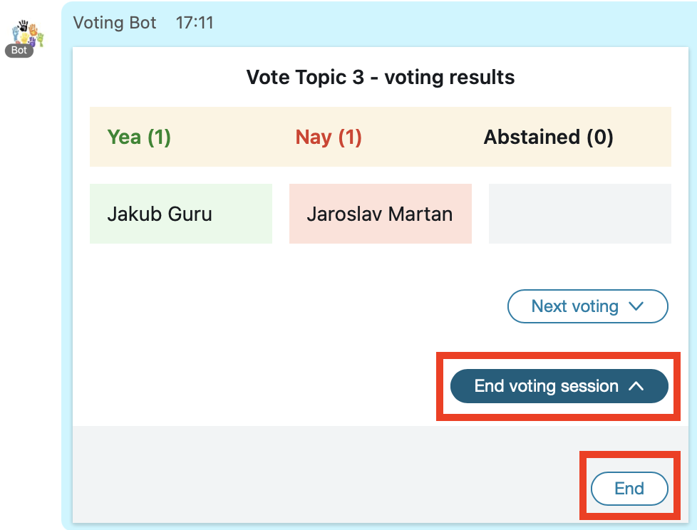

## What is Voting Bot
Poll (Voting Bot) is a demonstration of how [Buttons & Cards](https://developer.webex.com/docs/api/guides/cards) can be used
in a Webex Space. The major benefits are:
* **easy-to-use user interface** - no need for text-based interaction
* **all user actions carry the user's identity** - in this example the votes are automatically associated with the users
who clicked Yea/Nay/Abstain.
* **no message overload** - the user responses are collected by the Bot at the backend and it's up to the Bot what's sent
to the Space (for example just a voting summary)
* **Buttons & Cards are messages as any other** - they can be also deleted from the Space. This is an easy way to stop voting as
there are no more buttons to click.
### How it works
Once the Bot is up and running and has its [Webhooks](https://developer.webex.com/docs/api/guides/webhooks) active, the user
adds the Bot to a Webex Space. Bot sends a settings card for language selection and then sends a welcome card which allows
to start a voting session.

If there are moderators in the Space, only they are allowed to start/end the session or start a voting. If there are no moderators,
any Space member can manage the session. Once the session is started, Bot sends another card which allows to start
a particular voting. Topic and time limit has to be set for the voting. **Present** button allows to record a user's presence.
Once the user is "present", his vote is recorded no matter if he actively clicks during the voting. If the user doesn't vote,
his vote is recorded as "abstained". Once the user actively participates in the voting, no matter if he pressed the **Present**,
he is taken as "present" until the end of session.

Voting card is sent to the Space and all Space members can click the buttons. Last click is taken as valid.

At the end of the time limit or if a user clicks **End voting**, the voting card is deleted and no more votes can be cast. Voting
summary with optional Excel sheet is sent to the Space.

Multiple votings can be run during a single session. Once the user decides to end the session,

Excel file with all votings summary is sent the Space. As the file is a part of the Space content, it is available for download
to all Space members.

## How to run
The Poll (Voting) Bot is designed to run in Amazon Lambda. Use [Zappa](https://github.com/Miserlou/Zappa) to deploy it. It's using DynamoDB to store its data and runs in Flask WSGI. In development mode it can run locally as DynamoDB is provided as a Docker container and Flask can be started in development mode.

## Installing & running locally
### Requirements:
* Docker installed
* NGROK account and software installed

### Installation / initialization steps:
1. initialize virtual environment `python3 -m venv venv`
2. switch to virtual environment `source venv/bin/activate`
3. install required packages `pip install -r requirements.txt`
4. start local DynamoDB `docker run -p 8000:8000 amazon/dynamodb-local`
5. start NGROK, forward HTTP to local port 5050 `ngrok http 5050`
6. create a Webex Teams Bot at https://developer.webex.com/my-apps/new, get Bot ID and Access Token
7. copy `.env_sample` to `.env_local`, paste Access Token to `WEBEX_TEAMS_ACCESS_TOKEN`
8. use Access Token to get the Bot Id. Either visit the https://developer.webex.com/docs/api/v1/people/get-my-own-details
and replace the Authorization with the Bot's Access Token, or run `curl https://webexapis.com/v1/people/me -H "Authorization: Bearer <paste_bot_access_token>"`. Get the value of **id**. Paste the Bot id to `BOT_ID` in .env_local.
9. start the Bot `dotenv -f .env_local run python poll_bot.py`

### Testing the Bot
1. copy the URL provided by NGROK and open it in a web browser
2. the GET request from the web browser initializes the Bot's webhooks, success screen should be displayed int the browser
3. add Bot to a space
4. follow Bot's instructions to create a meeting and run polls
