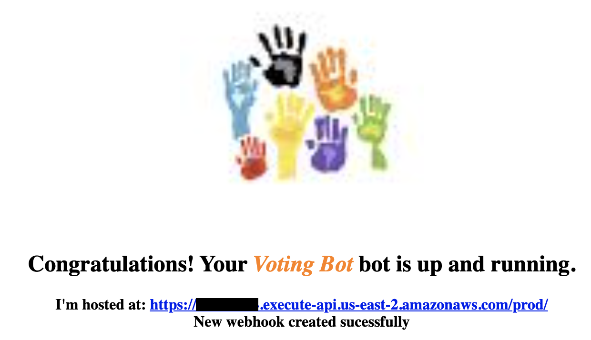

[What is Voting Bot](#what-is-voting-bot)  
[How to run](#how-to-run)  
[Installing & running locally](#installing--running-locally)  
[AWS Lambda / Zappa Notes](#aws-lambda--zappa-notes)  
[What I've learned, interesting parts of the code](#what-ive-learned-interesting-parts-of-the-code)  
## What is Voting Bot
Poll (Voting) Bot is a demonstration of how [Buttons & Cards](https://developer.webex.com/docs/api/guides/cards) can be used in a Webex Space. The major benefits are:
* **easy-to-use user interface** - no need for text-based interaction
* **all user actions carry the user's identity** - in this example the votes are automatically associated with the users who clicked Yea/Nay/Abstain.
* **no message overload** - the user responses are collected by the Bot at the backend and it's up to the Bot what's sent to the Space (for example just a voting summary)
* **Buttons & Cards are messages as any other** - they can be also deleted from the Space. This is an easy way to stop voting as there are no more buttons to click.
### How it works
Once the Bot is up and running and has its [Webhooks](https://developer.webex.com/docs/api/guides/webhooks) active, the user adds the Bot to a Webex Space. Bot sends a settings card for language selection and then sends a welcome card which allows to start a voting session.  
  
If there are moderators in the Space, only they are allowed to start/end the session or start voting. If there are no moderators, any Space member can manage the session. Once the session is started, Bot sends another card which allows to start a particular voting. Topic and time limit has to be set for the voting. **Present** button allows to record a user's presence. Once the user is "present", his vote is recorded no matter if he actively clicks during the voting. If the user doesn't vote, his vote is recorded as "abstained". Once the user actively participates in the voting, no matter if he pressed the **Present**, he is taken as "present" until the end of the session.  
  
Voting card is sent to the Space and all Space members can click the buttons. Last click is taken as valid for each user.  
  
At the end of the time limit or if a user clicks **End voting**, the voting card is deleted and no more votes can be cast. Voting summary with optional Excel sheet is sent to the Space.  
  
Multiple votings can be run during the session. Once the user decides to end the session,
  
Excel file with all votings summary is sent the Space. As the file is a part of the Space content, it is available for download to all Space members.  
  

## How to run
The Poll (Voting) Bot is designed to run in Amazon Lambda. Use [Zappa](https://github.com/Miserlou/Zappa) to deploy it. It's using DynamoDB to store its data and runs in Flask WSGI. In development mode it can run locally as DynamoDB is provided as a Docker container and Flask can be started in development mode.

## Installing & running locally
### Requirements:
* Docker installed
* NGROK account and software installed

### Installation / initialization steps:
1. initialize virtual environment `python3 -m venv venv`
2. switch to virtual environment `source venv/bin/activate`
3. install required packages `pip install -r requirements.txt`
4. start local DynamoDB `docker run -p 8000:8000 amazon/dynamodb-local`
5. start NGROK, forward HTTP to local port 5050 `ngrok http 5050`
6. create a Webex Teams Bot at https://developer.webex.com/my-apps/new, get Bot ID and Access Token
7. copy `.env_sample` to `.env_local`, paste Access Token to `WEBEX_TEAMS_ACCESS_TOKEN`
8. use Access Token to get the Bot Id. Either visit the https://developer.webex.com/docs/api/v1/people/get-my-own-details
and replace the Authorization with the Bot's Access Token, or run `curl https://webexapis.com/v1/people/me -H "Authorization: Bearer <paste_bot_access_token>"`. Get the value of **id**. Paste the Bot id to `BOT_ID` in .env_local.
9. start the Bot `dotenv -f .env_local run python poll_bot.py`

### Testing the Bot
1. copy the URL provided by NGROK and open it in a web browser
2. the GET request from the web browser initializes the Bot's webhooks, success screen should be displayed int the browser
3. add Bot to a space
4. follow Bot's instructions to create a meeting and run polls

## AWS Lambda / Zappa Notes
The Bot is using [python-dotenv](https://pypi.org/project/python-dotenv/) to pass sensitive information, like Access Token, to the Python script. AWS Lambda with [Zappa](https://github.com/Miserlou/Zappa) allows to run multiple  instances of the same application. For example **dev**, **production**, etc. In order to allow the Vote Bot to run in such an environment the Bot allows Zappa to pass **DOT_ENV_FILE** environment variable to the script. **DOT_ENV_FILE** is a filename which contains the environment variables loaded by Dotenv. If there is no **DOT_ENV_FILE** the Bot loads the variables from **.env** file. So if you used **.env_local** to run the Bot locally, copy it to **.env** before loading the script to AWS. Or you can set the **DOT_ENV_FILE** in **zappa_settings.json** to use a different .env file for each application instance. For example:
```
{
    "dev": {
      ...
        "environment_variables": {
            "DOT_ENV_FILE": ".env_local"
        },
    },
    "prod": {
      ...
        "environment_variables": {
            "DOT_ENV_FILE": ".env_prod"
        }
    }
}
```
Consult the [Zappa](https://github.com/Miserlou/Zappa) documentation on how to set it up and get it working
with your AWS account.

## What I've learned, interesting parts of the code
I'm not a professional programmer, coding is for me a way to play and learn. This section is an unordered list of things I've learned when creating the Bot.
### NoSQL database with a single table
I use AWS to host my creations, so for a database storage I decided to use [DynamoDB](https://aws.amazon.com/dynamodb/). Which is NoSQL. When trying to learn how to use it effectively, I came across [this article](https://www.trek10.com/blog/dynamodb-single-table-relational-modeling). Based on that I've implemented [ddb_single_table_obj.py](./ddb_single_table_obj.py). It doesn't implement all DynamoDB features and some parts are not fully tested but it serves the purpose and it helped me to learn a bit how to use NoSQL.
### HTTP GET / POST to the same URL
[Webhooks](https://developer.webex.com/docs/api/guides/webhooks) registered to the Webex platform need to be hosted on URLs which are accessible via Internet. When your application is hosted in a public cloud like AWS, you can't easily chose the public hostname at which your webhook is listening. The URL creation is automated and is part of the installation process. And you can't set it upfront in the application configuration (unless you want to pay an extra fee). Typically you learn the hostname (and URL) after the application is installed. Webhook is using HTTP POST method, so GET is available for something different. For example to receive a manual request from your web browser.

The GET/POST implementation in the Bot in `spark_webhook()` distinguishes between GET and POST. If it's a POST it expects the Webhook data, if it's GET a webhook setup procedure is run. First it learns the URL to which the GET was delivered (and at which the Bot is hosted) and then runs the webhook setup in `create_webhook()`. If you move the Bot from lab to production you do not need to change anything in the configuration. After the Bot is installed or its credentials changed, just copy the Bot URL which you learned from the installation process and paste it to your web browser. The Bot changes the webhook setup and sends you a greeting page.  
  
### Dotenv and Venv
Use [python-dotenv](https://pypi.org/project/python-dotenv/) and [venv](https://python.land/virtual-environments/virtualenv) always and everywhere. Even for a small project. Venv makes the code easily portable to another platform by exporting/importing the requirements. Dotenv is a way to keep your sensitive information safe. No need to paste Access Token or other credentials to your code.
### Finite-state machine
[Finite-state machine (FSM)](https://medium.datadriveninvestor.com/state-machine-design-pattern-why-how-example-through-spring-state-machine-part-1-f13872d68c2d) is one of the classical software design patterns. The Bot has a couple of states (session active/inactive, voting active/inactive, etc.). After exploring a few dead ends I figured out that FSM is the way to go. Since many of buttons&cards remain in the Space, users can click them any time. So it's important that the Bot responds only to the clicks (events) which are related to the current state.
### Webex Buttons & Cards Designer
Apart of the official [Adaptive cards designer](https://adaptivecards.io/designer/) there is [Webex Buttons & Cards Designer](https://developer.webex.com/buttons-and-cards-designer) which provides the set of features implemented in Webex and is using the Webex UI look end feel. The designer output is in JSON format so in order to import it into Python you can do just a copy&paste and then replace **true** with **True** and you end up with a native Python dict. This is useful for removing duplicities. In the code the cards can be composed of a skeleton structure and then a couple of references to commonly used blocks. See for example how `SETTINGS_BLOCK` is used in [bot_buttons_cards.py](./bot_buttons_cards.py).

On top of that I've changed all strings to be referenced indirectly and put in place using `bot_buttons_cards.nested_replace()`. Any string in a message or a card can be referenced by `{{keyword}}`. `nested_replace()` converts the card or an original string to its final value. This makes the localization easy - localization strings are in [localization_strings.py](./localization_strings.py). And cards can be filled with the current information - for example a session name or voting topic.
